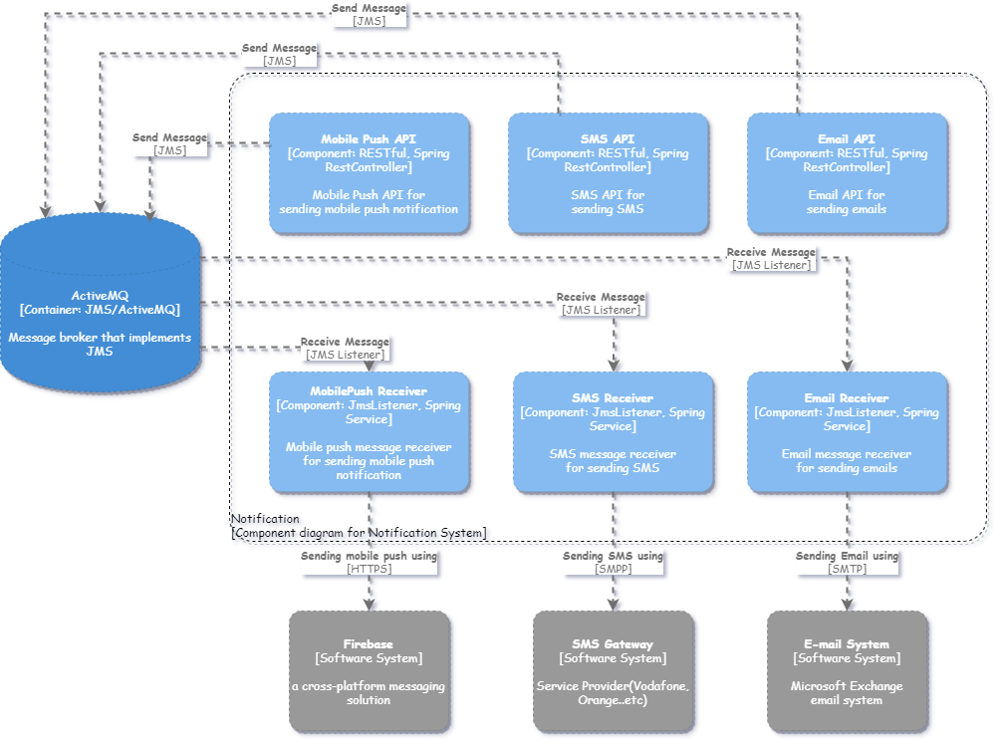

# Notification System
The propose of this system is to send notifications by Email, SMS, and Mobile push. Also, client can call its endpoints
to send notification or send them via [Apache ActiveMQ](https://activemq.apache.org/) Queues.

## Features:

* Email Notification
* SMS Notification
* Mobile push notification
* Schedule notification
* Swagger API Documentation
* Failure Messages

# Getting Started

First, Mack sure you already installed Apache Maven, Docker and docker-compose on your environment, then run:

`./mvn clean install -Dactivemq=<activemq host> && docker-compose up`

If you don't have any ActiveMQ server installed you can skip test with:

`./mvn clean install -DskipTests && docker-compose up`

To see the full documentation of the API go to [Swagger](http://localhost:8080/notifications/swagger-ui/index.html)
also, you can try the API from swagger directly

## Software Architecture and System Design

### System Context diagram

As you can see Notification System is integrated with three other systems:
* Microsoft Exchange for sending E-mail
* System Providers like Vodafone to send SMS
* Firebase to send Mobile push notification

### Container diagram

Notification system is using [Apache ActiveMQ](https://activemq.apache.org/) for receiving messages and schedule messages.
If your system has access to Apache ActiveMQ, so we recommend using one of the following queues instead of using REST endpoints
for better performance and better message lose.

#### Queues:
* `notification-email` for sending E-mails
* `notification-sms` for sending SMS
* `notification-mobile-push` for sending Mobile push

#### Failure Queues:

* `notification-email-faild` for sending E-mails
* `notification-sms-faild` for sending SMS
* `notification-mobile-push-faild` for sending Mobile push

These Queues used when something goes wrong with the integrations with other systems while sending notifications 

### Component diagram

As you can see the Notification system has three endpoints for each type of notification, since each type of notification
has a different payload.

The reason of adding endpoints is for clients that cannot contact Apache ActiveMQ directly and when request comes to any of 
the endpoints, the endpoint validates the request's parameters and send it to the correct queue Apache ActiveMQ.

#### Endpoints
* [/notifications/email/](http://localhost:8080/notifications/email/) for sending E-mails
* [/notifications/sms/](http://localhost:8080/notifications/sms/) for sending SMS
* [/notifications/mobile-push/](http://localhost:8080/notifications/mobile-push/) for sending Mobile push

### Class diagram

## How to use Notification system?

### Email notification

#### Email Payload

`{
"body": "string",
"cc": "string",
"from": "string",
"subject": "string",
"to": "string"
}`

#### Using API:

`curl -X POST "http://localhost:8080/notifications/email/" -H "accept: application/json" -H "Content-Type: application/json" -d 
"{ 'delay': 0, 'email': { 'body': 'Hello', 'cc': 'amawaziny@gmail.com', 'from': 'amawaziny@gmail.com', 'subject': 'Subject', 'to': 'amawaziny@gmail.com' }}"`

As you may note there is a parameter called _**delay**_ this parameter is used to schedule messages, 
it's long number of milliseconds.

#### Using Queue:

`jmsTemplate.convertAndSend('notification-email', emailPayload);`

And, to schedule an email while using queue

`jmsTemplate.setDeliveryDelay(30 * 1000);`

`jmsTemplate.convertAndSend('notification-email', emailPayload);`

### SMS notification

#### SMS Payload

` {
"body": "string",
"to": {
    "locale": "string",
    "value": "string"
}
}`

#### Using API:

`curl -X POST "http://localhost:8080/notifications/sms/" -H "accept: application/json" -H "Content-Type: application/json" -d "{ 'delay': 0, 'sms': { 'body': 'sms', 'to': { 'locale': 'EG', 'value': '01003009331' } }}"`

As you may note there is a parameter called _**delay**_ this parameter is used to schedule messages,
it's long number of milliseconds.

#### Using Queue:

`jmsTemplate.convertAndSend('notification-sms', smsPayload);`

And, to schedule a sms message while using queue

`jmsTemplate.setDeliveryDelay(30 * 1000);`

`jmsTemplate.convertAndSend('notification-sms', smsPayload);`

### Mobile push notification

#### Mobile push Payload

` {
"body": "string",
"deviceId": "string",
"os": "string" (ANDROID, IOS, BOTH)
}`

#### Using API:

`curl -X POST "http://localhost:8080/notifications/mobile-push/" -H "accept: application/json" -H "Content-Type: application/json" -d "{ 'delay': 0, 'mobilePush': { 'body': 'string', 'deviceId': 'string', 'os': 'ANDROID' }}"`

As you may note there is a parameter called _**delay**_ this parameter is used to schedule messages,
it's long number of milliseconds. Also, _**deviceId**_ is optional if you want to send to a specific user then use it.

#### Using Queue:

`jmsTemplate.convertAndSend('notification-mobile-push', mobilePushPayload);`

And, to schedule a mobile push message while using queue

`jmsTemplate.setDeliveryDelay(30 * 1000);`

`jmsTemplate.convertAndSend('notification-mobile-push', mobilePushPayload);`